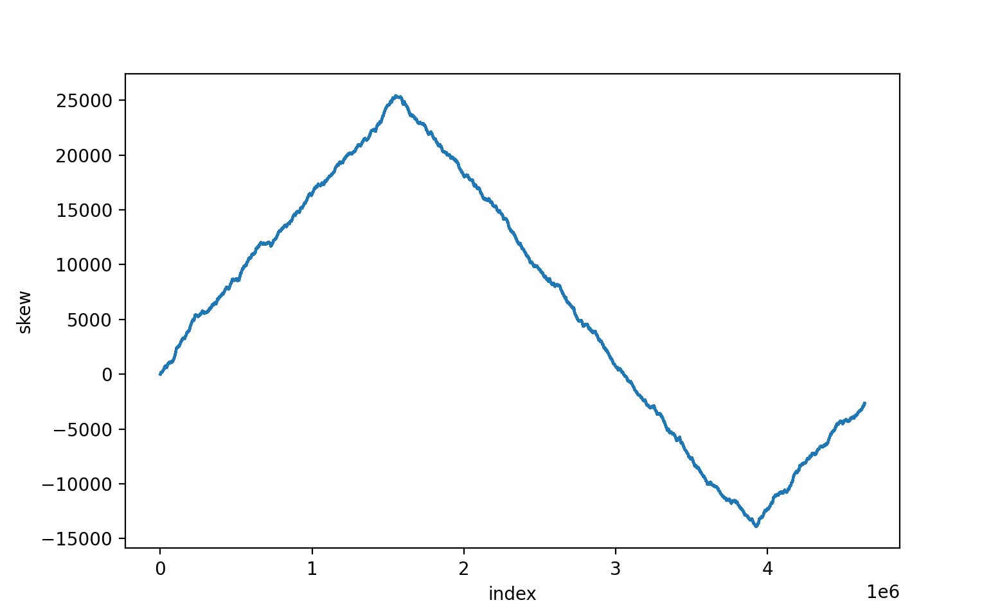

## Reference
- Bioinformatics Algorithms: An Active Learning Approach, Chapter 1
- https://www.bioinformaticsalgorithms.org/bioinformatics-chapter-1

## The Skew Diagram of E. coli

- `python3 -m chapter1.skew_visualize < chapter1/E_coli.txt`
