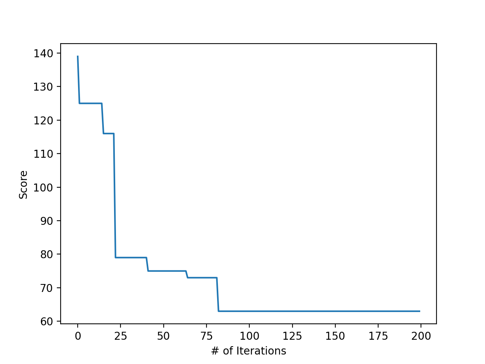

## Reference
- Bioinformatics Algorithms: An Active Learning Approach, Chapter 3
- https://www.bioinformaticsalgorithms.org/bioinformatics-chapter-2

## Randomized Motif Search Algorithm
- [An sample dataset](http://bioinformaticsalgorithms.com/data/extradatasets/motifs/randomized_motif_search.txt)
- Run script

```bash
$ python3 -m chapter3.randomized_motif_search < input.txt > output.txt
```

- The plot of scores by the number of iterations (iterated 200 times)
